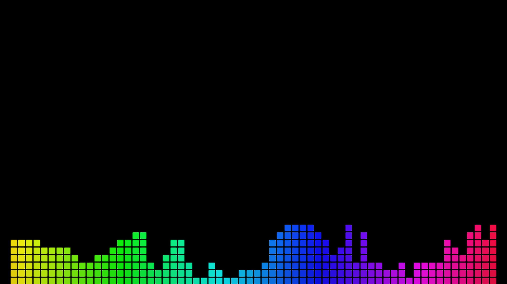
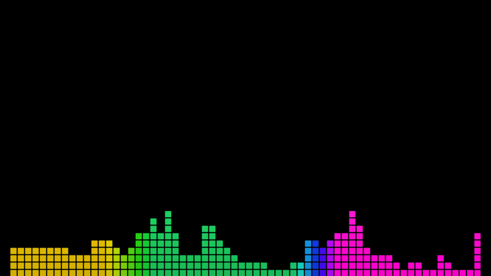
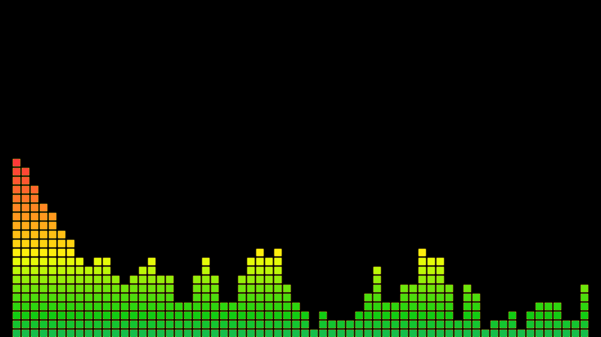
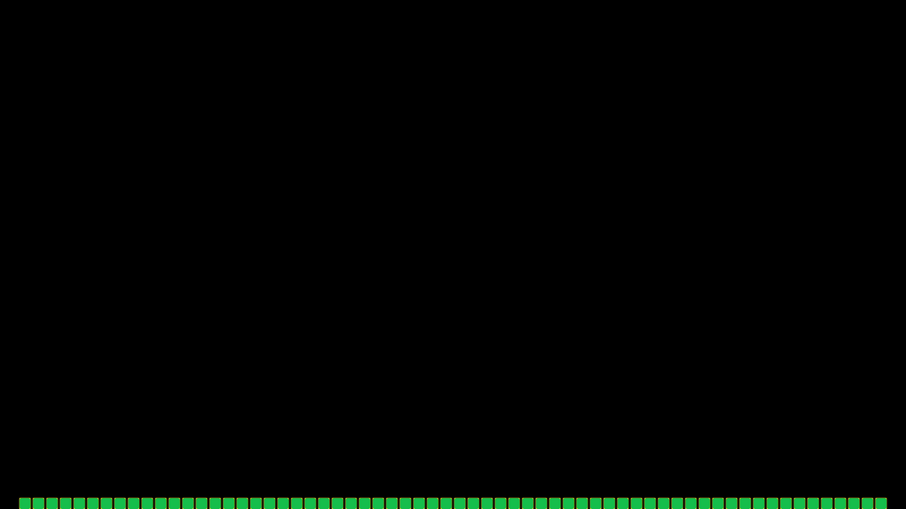
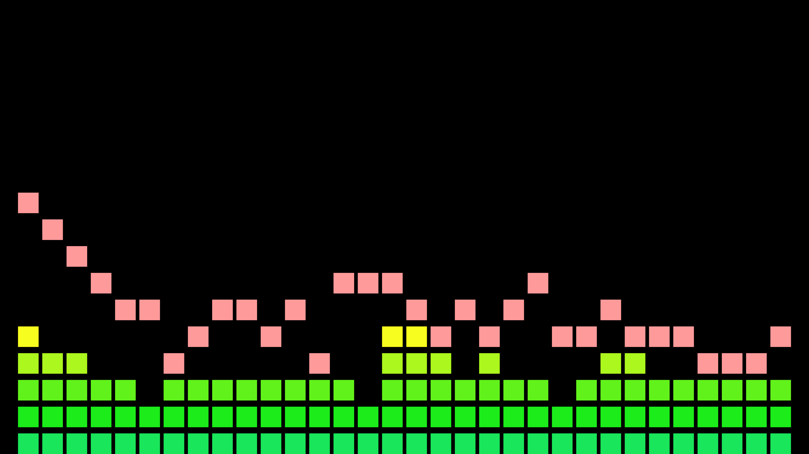

# Lively Bottom Visualizer

**English** · [Deutsch weiter unten](#deutsch)

LED-style audio spectrum for [Lively Wallpaper](https://github.com/rocksdanister/lively) — bars at the
**bottom of the screen** on a black background, **no reflection**, tuned for bass-heavy music
(hardstyle, hardcore, EDM). 60 FPS with interpolation, works at 1080p and 4K.

Based on [lively-audio-visualizer](https://github.com/eliasfloreteng/lively-audio-visualizer) by
[elias123tre](https://github.com/eliasfloreteng) — the circular visualizer that started this project.



## Features

- Segmented LED blocks (default) or solid bars; bar count, gaps and block size adjustable
- Six color modes, every color adjustable: rainbow (static or slowly drifting), two-color gradient,
  single color, **frequency bands** (own color for bass / mids / highs with adjustable boundaries),
  **level** (color by bar height, e.g. green → yellow → red), vertical rainbow
- Zero line: one row of blocks always stays lit, even in silence
- Audio processing built for Lively's raw FFT data: automatic gain, per-bar normalization,
  spectrum sharpening, adjustable frequency range and bass resolution, rise/fall smoothing
- Presets (folder `presets`), restore of your last settings after an update
- Settings panel in **English and German** (follows Lively's language), grouped into
  Style · Colors · Music & sensitivity · Extras · Background · Presets & backup · Performance
- Low resource use: color cache, reusable buffers, idle mode in silence (5 checks/s instead of 60 frames/s),
  FPS limiter, diagnostics overlay for the raw audio data

| Frequency bands | Level colors | Zero line (silence) |
|---|---|---|
|  |  |  |

Preset `classic-led.json`:



## Install

1. Download [`Bottom-Rainbow-Visualizer.zip`](https://github.com/ChrissiKey/lively-bottom-visualizer/raw/main/release/Bottom-Rainbow-Visualizer.zip) (also attached to the [releases](../../releases)).
2. Drag and drop the zip into the Lively window (or "+" → browse).
3. Play music. If nothing moves, choose the correct output device in
   Lively → *Settings → Wallpaper → Audio*.
4. Right-click the wallpaper → *Customize* for all settings.

## Presets, backup and updates

**Load a preset:** section 6 in the settings → choose a file → *Load preset*. Shipped presets:
`hardstyle.json` (default look), `classic-led.json` (green/yellow/red with peak markers),
`frequency-bands.json`, `calm-gradient.json`. A loaded preset survives restarts of Lively.
The sliders keep showing Lively's own values until you move one; a moved slider always wins.

**Back up your own settings:** Lively stores the values of the sliders in
`<Lively library folder>\SaveData\wpdata\<wallpaper folder>\<display>\LivelyProperties.json`
(the library folder is shown in Lively → *Settings → General*; the wallpaper folder is the one
that *Open file location* opens). Copy that file into the wallpaper's `presets` folder under any name,
and it appears as a preset — the wallpaper reads both preset formats.

**Update without losing settings:**
- *In place (recommended):* right-click the wallpaper → *Open file location* → replace the files
  with the new version. Your settings stay. New sliders appear only after *Restore default* in Lively's
  customize panel; afterwards press *Restore last settings* in section 6 to get your values back.
- *Fresh import of the new zip:* copy your backed-up `LivelyProperties.json` into the new `presets`
  folder and load it as a preset.

## Tips for hardstyle / bass-heavy music

- Peaks look too wide: lower *Bass resolution* (0–20), raise *Sharpen spectrum* (50–80),
  set *Normalize bars individually* to 50–80.
- Kicks should pump: *Fall smoothing* 30–50, *Rise smoothing* 5–20.
- Use the *diagnostics overlay* (section 7) to see which FFT bins your music actually hits,
  then set *Frequency range used* accordingly.

## Running while gaming

Lively decides whether a wallpaper keeps running behind full-screen apps
(*Settings → Performance*). The wallpaper honors Lively's pause signal and stops rendering
completely while paused. If you let it run on a second monitor, lower *Maximum frame rate*
to 30 and set *Glow* to 0 for the lowest load.

## Build the zip yourself

Zip the **contents** of the `wallpaper/` folder (not the folder itself):

```
cd wallpaper && zip -r ../Bottom-Rainbow-Visualizer.zip .
```

## How it works

Lively calls `livelyAudioListener(audioArray)` about 10–25 times per second with 128 raw, un-normalized
FFT magnitudes (index 0 = lowest frequency). The script maps bins to bars with an adjustable curve,
normalizes the level (global and per bar), sharpens local peaks, interpolates between audio frames
and draws everything on a full-screen canvas. Labels come from `LivelyProperties.json` (English) and
`LivelyProperties.loc.json` (German); Lively picks the language automatically.

## Credits

Based on [lively-audio-visualizer](https://github.com/eliasfloreteng/lively-audio-visualizer) by
[elias123tre](https://github.com/eliasfloreteng): the Lively integration, the customization approach and
the idea of a bass-compensated spectrum come from that project. The rendering and audio processing in
this repository were rewritten for the bottom-of-screen LED look. Visual style inspired by classic
LED spectrum analyzers.

## License

[MIT](LICENSE)

---

<a name="deutsch"></a>
## Deutsch

Balken-Spektrum in LED-Optik am **unteren Bildschirmrand** auf schwarzem Hintergrund, **ohne Spiegelung**,
abgestimmt auf basslastige Musik (Hardstyle, Hardcore, EDM). Basiert auf
[lively-audio-visualizer](https://github.com/eliasfloreteng/lively-audio-visualizer) von elias123tre.

**Installation:** [`Bottom-Rainbow-Visualizer.zip`](https://github.com/ChrissiKey/lively-bottom-visualizer/raw/main/release/Bottom-Rainbow-Visualizer.zip) laden, per Drag & Drop in Lively ziehen,
Musik abspielen. Reagiert nichts: in Lively unter *Einstellungen → Wallpaper → Audio* das richtige
Ausgabegerät wählen. Rechtsklick auf das Wallpaper → *Anpassen* öffnet alle Regler. Das Menü ist auf
Deutsch, wenn Lively auf Deutsch läuft, und in sieben Gruppen unterteilt: Stil · Farben · Musik &
Empfindlichkeit · Extras · Hintergrund · Presets & Sicherung · Leistung & Diagnose.

**Presets:** Gruppe 6 → Datei wählen → *Preset laden*. Mitgeliefert: `hardstyle.json`,
`classic-led.json`, `frequency-bands.json`, `calm-gradient.json`. Ein geladenes Preset überlebt
Neustarts. Die Regler zeigen weiter Livelys Werte, bis du einen bewegst; ein bewegter Regler gewinnt immer.

**Eigene Einstellungen sichern:** Lively speichert die Reglerwerte in
`<Lively-Bibliothek>\SaveData\wpdata\<Wallpaper-Ordner>\<Monitor>\LivelyProperties.json`
(die Bibliothek steht in Lively unter *Einstellungen → Allgemein*, den Wallpaper-Ordner öffnet
*Dateispeicherort öffnen*). Diese Datei unter beliebigem Namen in den Ordner `presets` des Wallpapers
kopieren, dann erscheint sie als Preset.

**Update ohne Verlust der Einstellungen:**
- *Direkt im Ordner (empfohlen):* Rechtsklick → *Dateispeicherort öffnen* → Dateien durch die neue
  Version ersetzen. Die Einstellungen bleiben. Neue Regler erscheinen erst nach *Standard wiederherstellen*
  in Livelys Anpassen-Fenster; danach in Gruppe 6 *Letzte Einstellungen wiederherstellen* drücken.
- *Neue ZIP importieren:* gesicherte `LivelyProperties.json` in den neuen `presets`-Ordner kopieren und
  als Preset laden.

**Tipps für Hardstyle:** Ausschläge zu breit → *Bass-Auflösung* runter (0–20), *Spektrum schärfen*
rauf (50–80), *Balken einzeln normieren* 50–80. Kicks sollen pumpen → *Glättung Abfall* 30–50,
*Glättung Anstieg* 5–20. Die *Diagnose-Anzeige* (Gruppe 7) zeigt die rohen Audiodaten von Lively.

**Spiele:** Ob das Wallpaper hinter Vollbild-Spielen weiterläuft, regelt Lively selbst
(*Einstellungen → Leistung*). Im Pause-Zustand rendert das Wallpaper nichts. Auf einem zweiten Monitor:
*Maximale Bildrate* auf 30 und *Leuchten* auf 0 für die geringste Last.

Lizenz: [MIT](LICENSE)
